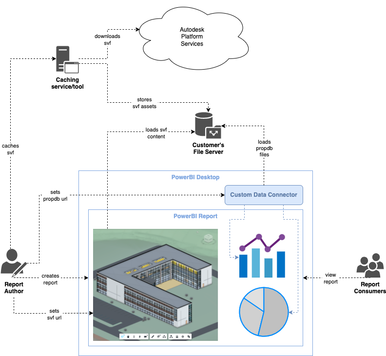

# Cached Derivatives

Another way of avoiding the authentication workflow is to download and store the derivatives generated by Autodesk Platform Services for a specific design, and serve them yourself.

## Pros

- no login required for viewing
- no custom web service needed
- _properties.sqlite_ can be read by built-in ODBC data connector

## Cons

- more work for report author
  - downloading and hosting SVFs on a (path-enabled) file server
- only SVF(1)
- needs a file server (`file://` is blocked by browsers)
