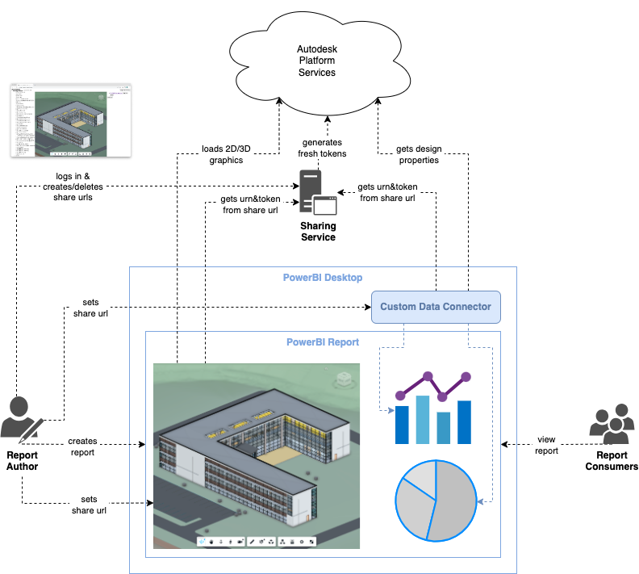

# Custom Shares

This solution relies on a separate web service that can generate fresh authentication tokens for anyone who wants to view the report in the future.

## Pros

- report authoring is simple - simply provide the share URL to visuals and data connectors
- no login required for viewing
- reports can be accessed by users who don't have access to the original design

## Cons

- requires a custom web service and storage
