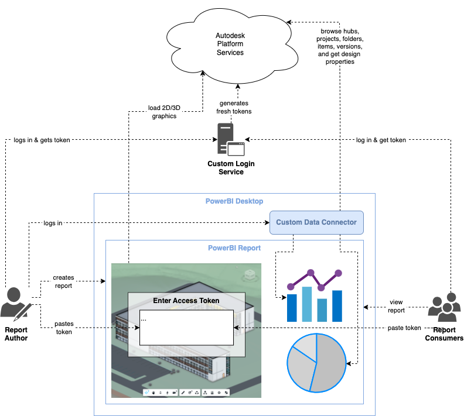

# Endymion v1

## Pros

- simple backend service; no storage needed

## Cons

- data connector needs to store APS client ID and **secret**
- when authoring or viewing the report, users always have to login
- requires a custom web service for OAuth and for getting design properties
