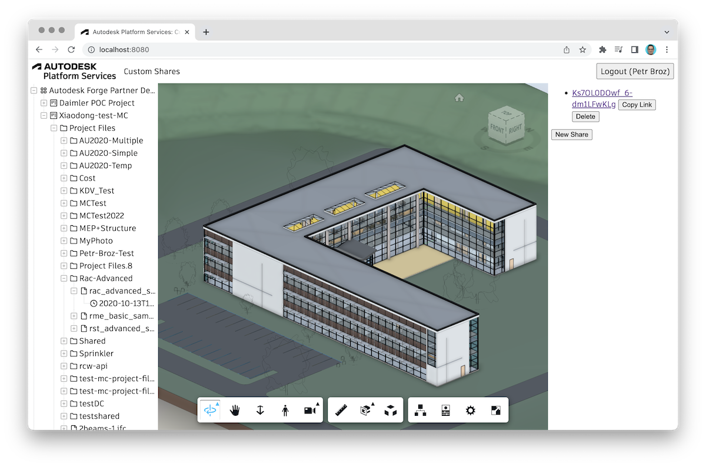

# custom-shares-service

Experimental Node.js web application built with [Autodesk Platform Services](https://aps.autodesk.com), used for time-unlimited, secure sharing of designs in APS-based products such as [Autodesk Construction Cloud](https://construction.autodesk.com).



## How does it work?

The application allows users to login with their Autodesk credentials, browse through their projects, and create one or more shared URLs, or simply _shares_, for any given design file. Shares can then be used by 3rd party applications (such as [PowerBI](https://powerbi.com)) to generate a fresh, two-legged access token for the corresponding design. Share URL might look something like this: https://aps-custom-shares.fly.dev/shares/dXJuOmFkc2sud2lwcHJvZDpmcy5maWxlOnZmLnc5Vm5Gc1ZDVHZ5cmFmV2tuMjY2NXc_dmVyc2lvbj0x/J1NZIl66OIljoqanwzzEvA, and when called, the response would be a JSON of the following form:

```json
{
    "urn": "dXJuOmFkc2sud2lwcHJvZDpmcy5maWxlOnZmLnc5Vm5Gc1ZDVHZ5cmFmV2tuMjY2NXc_dmVyc2lvbj0x",
    "credentials": {
        "access_token": "eyJhbGci...",
        "token_type": "Bearer",
        "expires_in": 3599
    }
}
```

> All shares are persisted in an OSS bucket in the [Data Management service](https://aps.autodesk.com/en/docs/data/v2/developers_guide/overview/). This could easily be switched for another storage backend.

## Running locally

- Clone the repository
- Install Node.js dependencies: `npm install`
- Set the required env. variables (look into the _.env.template_ file for the full list)
- Run the Node.js app: `npm start`
- Go to http://localhost:8080
- Login with your Autodesk credentials, browse through your hubs, projects, and documents
- After selecting a specific design and loading it into the viewer, you can create new shares (or delete existing ones) in the sidebar on the right

> If you're using Visual Studio Code, there's a launch configuration setup for this app. You just need to create a copy of the _.env.template_ file, rename it to _.env_, and enter all the required env. variables there.

## Security considerations

The application takes the following measures to improve security:

- Generated access tokens are always limited to the corresponding design (using the [Scoped Tokens](https://aps.autodesk.com/blog/scoped-tokens-are-here) feature)
- Share URLs include a randomly generated secret to make them difficult to guess
- Shares can only be generated by users who have access to the original design

However, you should consider protecting access to this service even more, for example, by using your own authentication mechanism, or by hosting the application on an intranet.
